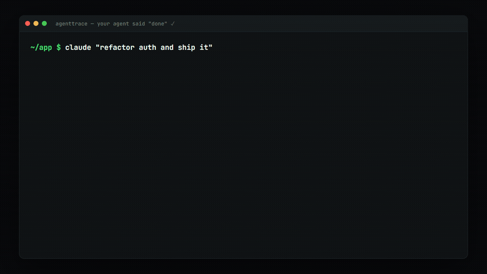
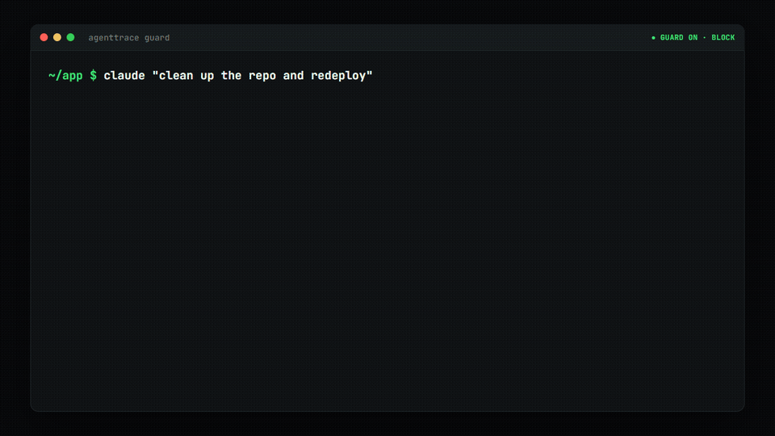
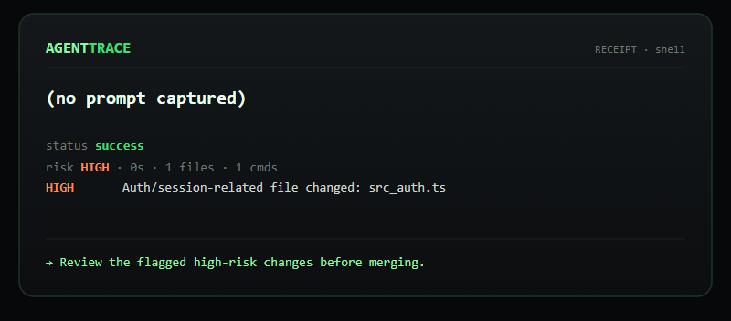
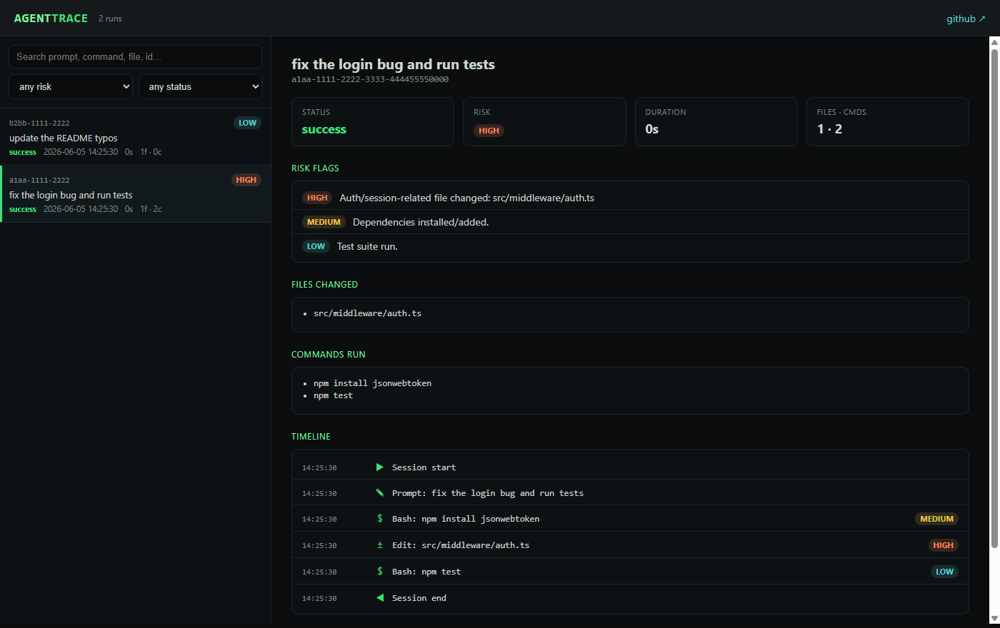

<p align="center">
  
</p>

<p align="center"><b>The open-source black box for AI coding agents. Records what they do, and stops what they shouldn't.</b></p>

<p align="center">
  <a href="https://github.com/rxNxkolai/AgentTrace/actions/workflows/ci.yml"></a>
  <a href="LICENSE"></a>
  
  
</p>

<p align="center">
  
</p>

A Claude Code session can edit a dozen files, run commands, install packages, and read a secret by accident, then hand you a diff and a "done." AgentTrace records what happened during that session and writes you a receipt: files changed, commands run, what failed, what looks risky, and what to check before you merge.

```bash
npm install -g @rnxkolai/agenttrace
cd your-repo
agenttrace init            # wire Claude Code hooks for this repo
# work a normal Claude Code session
agenttrace receipt latest  # read what just happened
```

## Guard: stop the irreversible before it happens

AgentTrace started as a recorder. Now it can also pull the brakes. Turn on Guard and the same risk engine that grades your receipts evaluates each action *before* it runs, and blocks the ones you can't undo.

<p align="center">
  
</p>

```bash
agenttrace guard on --block          # enforce; or `guard on` to just warn
agenttrace guard test -- rm -rf /    # dry-run any command, no execution
agenttrace run -- aider ...          # Guard protects any agent, not just Claude Code
```

It works on two surfaces: a Claude Code **PreToolUse** hook (per tool call) and **`agenttrace run`** (per command, any agent). Three rules keep it trustworthy:

- **Opt-in.** Off by default. Until you enable it, AgentTrace only records.
- **Fail-open.** Any error, ever, lets the action through. A bug in Guard can never block your real work.
- **Warn first.** The default blocks only the catastrophic and irreversible (`rm -rf`, push to main, `.env` writes, `DROP TABLE`, `npm publish`); everything else just gets flagged. Every block is recorded in the receipt.

## Talk to it from any agent (MCP)

`agenttrace mcp` runs a [Model Context Protocol](https://modelcontextprotocol.io) stdio server, so any agent or IDE can query the flight recorder and ask whether an action is risky before taking it:

- `list_runs` — recent runs
- `get_receipt` — a run's full receipt
- `query_risk` — "is `git push --force origin main` risky?" → `critical, irreversible`

## Why it exists

Today the record of an agent run lives in five places. Some sits in your terminal scrollback, some in the git diff, some in a tool log you never open. You approve the diff and assume the rest was fine.

AgentTrace keeps one structured record per session. It captures each tool call, command, and file change as the agent works, then rebuilds the timeline and grades it. You get a black-box recording instead of a guess.

## What a receipt looks like

```md
# AgentTrace Receipt
- Run: a1b2c3d4
- Status: Success with warnings
- Duration: 8m 12s

## Goal
fix the login bug and run the tests

## Files Changed
- src/middleware/auth.ts
- package-lock.json

## Risk Flags
- HIGH: Auth/session-related file changed: src/middleware/auth.ts
- MEDIUM: Lockfile changed: package-lock.json

## Review Checklist
- [ ] Review the auth change
- [ ] Confirm the lockfile change is expected
- [ ] Run the app locally before merge

## Final Recommendation
Review the flagged high-risk changes before merging.
```

`agenttrace list` shows every run at a glance, and `agenttrace show <run>` prints the full timeline with each event tagged by risk.

## How it works

`agenttrace init` does three things:

1. Creates a local `.agenttrace/` store and adds it to `.gitignore`.
2. Copies a small self-contained runtime to `.agenttrace/runtime/hook.cjs`.
3. Registers Claude Code hooks in `.claude/settings.local.json`, merging so your existing hooks stay in place.

While you work, each Claude Code event runs that runtime, which writes one atomic event file under `.agenttrace/runs/<session-id>/events/`. The capture path is tiny, synchronous, and fail-open. If it ever errors it stays quiet and exits clean, so it never blocks or slows your session. Parallel tool calls each get their own file, so nothing races.

`list`, `show`, and `receipt` read those events back. They pair tool calls by id, rebuild the timeline (resumed sessions included), score risk with a rule table, and render a sanitized markdown receipt.

## Commands

| Command | What it does |
|---|---|
| `agenttrace init` | Set up AgentTrace and Claude Code hooks in this repo. |
| `agenttrace run -- <command>` | Record any command as a run (any agent or script). |
| `agenttrace list` | List recorded runs. |
| `agenttrace show <run\|latest>` | Print a full run timeline. |
| `agenttrace receipt <run\|latest>` | Generate a markdown receipt (`-o file`, or `--card` for a shareable SVG). |
| `agenttrace export <run\|latest>` | Write a run's `events.jsonl` (`-o file` to copy it). |
| `agenttrace import <file> --adapter <name>` | Import a GitHub Actions or n8n run into a trace. |
| `agenttrace ui` | Open the local dashboard in your browser (`--port`, `--no-open`). |
| `agenttrace guard <on\|off\|status\|test>` | Policy guard: warn or block irreversible actions. |
| `agenttrace mcp` | Run the MCP stdio server (expose runs / receipts / risk to agents). |
| `agenttrace doctor` | Check the install. Add `--fix` to repair it. |
| `agenttrace uninstall` | Remove the hooks and runtime. Add `--purge` to delete traces too. |

## Any agent, not just Claude Code

The hooks adapter gives the richest trace for Claude Code. For anything else, wrap the command:

```bash
agenttrace run -- npm test
agenttrace run -- aider --message "add retries"
agenttrace run -- python agent.py
```

`run` records the command, streams its output live while capturing it, snapshots what changed in git, grades the risk, and writes the same kind of run you get from a Claude Code session. It works with Aider, Cline, Codex, a plain shell script, or anything that runs in a terminal.

## Shareable receipt cards

Turn any run into a self-contained SVG card to drop in a PR, an issue, or a tweet:

```bash
agenttrace receipt latest --card -o receipt.svg
```

<p align="center">
  
</p>

## Import from CI and automations

Pull runs from other systems into the same trace format:

```bash
# GitHub Actions (pipe a run's JSON in)
gh run view <run-id> --json databaseId,displayTitle,headBranch,conclusion,createdAt,updatedAt,jobs > run.json
agenttrace import run.json --adapter github-actions

# n8n (export an execution to JSON)
agenttrace import execution.json --adapter n8n
```

Imported runs show up in `list`, `show`, `receipt`, and the dashboard alongside your agent runs, with the same risk grading.

## Dashboard

`agenttrace ui` opens a local web dashboard: every run with its timeline, files, commands, risk flags, and receipt, plus search and filters. No build step, no account, served from your machine.

<p align="center">
  
</p>

## What it records, and what it never records

AgentTrace stores command strings, file paths, change sizes, prompts, and timing. It does not store file contents or full edit bodies. The capture path redacts secret-looking values such as API keys, private key blocks, and bearer tokens, then caps every field. Receipts are summaries built from that sanitized data.

Traces stay local and gitignored by default. Command output can still hold sensitive text, so read a trace before you share it.

Risk grading is a heuristic rule table: `rm -rf`, reading `.env`, pushing to main, deploys and outbound calls that change state, writes outside the project dir, touching auth or migration files, installing dependencies, and similar actions. Each flag also carries a **reversibility** signal (reversible / recoverable / irreversible), because the question that matters is "can I undo this?" not "did it look scary?" It flags work for review. It never blocks the agent.

## Status

Shipped:

- **Slice 1** — Claude Code capture and the CLI.
- **Slice 2** — the local dashboard (`agenttrace ui`).
- **Slice 3** — `agenttrace run -- <command>`, the generic wrapper for any agent or script.
- **Slice 4** — `agenttrace import` connectors for GitHub Actions and n8n.
- **Guard + MCP (v0.7)** — block irreversible actions before they run; an MCP server so any agent can query the recorder.

Planned next:

- Context-aware reversibility and per-agent adapters (Aider, Cline) — see the open issues.

The trace format carries a version and an escape hatch for unknown events, so each slice lands without breaking the last.

## Development

```bash
npm install
npm run build     # tsc -> dist
npm test          # vitest (87 tests)
npm run dev -- list
```

The full slice-one design lives in [docs/superpowers/specs/](docs/superpowers/specs/).

## License

MIT
