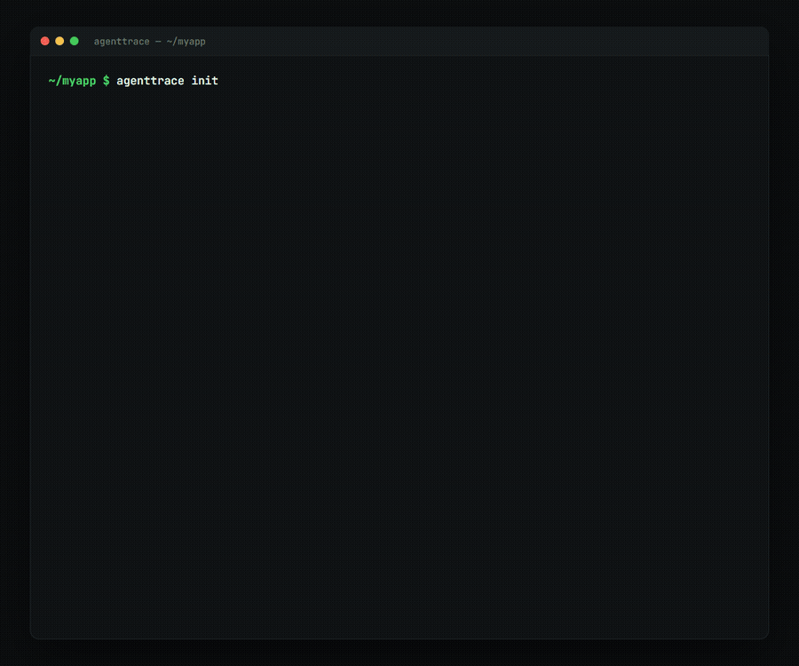

<p align="center">
  
</p>

<p align="center"><b>The open-source flight recorder for AI agents.</b></p>

<p align="center">
  <a href="https://github.com/rxNxkolai/AgentTrace/actions/workflows/ci.yml"></a>
  <a href="LICENSE"></a>
  
  
</p>

<p align="center">
  
</p>

A Claude Code session can edit a dozen files, run commands, install packages, and read a secret by accident, then hand you a diff and a "done." AgentTrace records what happened during that session and writes you a receipt: files changed, commands run, what failed, what looks risky, and what to check before you merge.

```bash
npm install -g agenttrace
cd your-repo
agenttrace init            # wire Claude Code hooks for this repo
# work a normal Claude Code session
agenttrace receipt latest  # read what just happened
```

## Why it exists

Today the record of an agent run lives in five places. Some sits in your terminal scrollback, some in the git diff, some in a tool log you never open. You approve the diff and assume the rest was fine.

AgentTrace keeps one structured record per session. It captures each tool call, command, and file change as the agent works, then rebuilds the timeline and grades it. You get a black-box recording instead of a guess.

## What a receipt looks like

```md
# AgentTrace Receipt
- Run: a1b2c3d4
- Status: Success with warnings
- Duration: 8m 12s

## Goal
fix the login bug and run the tests

## Files Changed
- src/middleware/auth.ts
- package-lock.json

## Risk Flags
- HIGH: Auth/session-related file changed: src/middleware/auth.ts
- MEDIUM: Lockfile changed: package-lock.json

## Review Checklist
- [ ] Review the auth change
- [ ] Confirm the lockfile change is expected
- [ ] Run the app locally before merge

## Final Recommendation
Review the flagged high-risk changes before merging.
```

`agenttrace list` shows every run at a glance, and `agenttrace show <run>` prints the full timeline with each event tagged by risk.

## How it works

`agenttrace init` does three things:

1. Creates a local `.agenttrace/` store and adds it to `.gitignore`.
2. Copies a small self-contained runtime to `.agenttrace/runtime/hook.cjs`.
3. Registers Claude Code hooks in `.claude/settings.local.json`, merging so your existing hooks stay in place.

While you work, each Claude Code event runs that runtime, which writes one atomic event file under `.agenttrace/runs/<session-id>/events/`. The capture path is tiny, synchronous, and fail-open. If it ever errors it stays quiet and exits clean, so it never blocks or slows your session. Parallel tool calls each get their own file, so nothing races.

`list`, `show`, and `receipt` read those events back. They pair tool calls by id, rebuild the timeline (resumed sessions included), score risk with a rule table, and render a sanitized markdown receipt.

## Commands

| Command | What it does |
|---|---|
| `agenttrace init` | Set up AgentTrace and Claude Code hooks in this repo. |
| `agenttrace list` | List recorded runs. |
| `agenttrace show <run\|latest>` | Print a full run timeline. |
| `agenttrace receipt <run\|latest>` | Generate a markdown receipt (`-o file` to save it). |
| `agenttrace export <run\|latest>` | Write a run's `events.jsonl` (`-o file` to copy it). |
| `agenttrace doctor` | Check the install. Add `--fix` to repair it. |
| `agenttrace uninstall` | Remove the hooks and runtime. Add `--purge` to delete traces too. |

## What it records, and what it never records

AgentTrace stores command strings, file paths, change sizes, prompts, and timing. It does not store file contents or full edit bodies. The capture path redacts secret-looking values such as API keys, private key blocks, and bearer tokens, then caps every field. Receipts are summaries built from that sanitized data.

Traces stay local and gitignored by default. Command output can still hold sensitive text, so read a trace before you share it.

Risk grading is a heuristic rule table: `rm -rf`, reading `.env`, pushing to main, touching auth or migration files, installing dependencies, and similar actions. It flags work for review. It never blocks the agent.

## Scope

This is slice one: Claude Code capture and the CLI. It exists to prove one thing, that a recorded session produces a receipt worth reading.

Planned next:

- **Slice 2** — a local dashboard (`agenttrace ui`) with a SQLite index and search.
- **Slice 3** — a generic `agenttrace run -- <command>` wrapper for any agent or script.
- **Slice 4** — import adapters for n8n and GitHub Actions.

The trace format carries a version and an escape hatch for unknown events, so each slice lands without breaking the last.

## Development

```bash
npm install
npm run build     # tsc -> dist
npm test          # vitest (33 tests)
npm run dev -- list
```

The full slice-one design lives in [docs/superpowers/specs/](docs/superpowers/specs/).

## License

MIT
